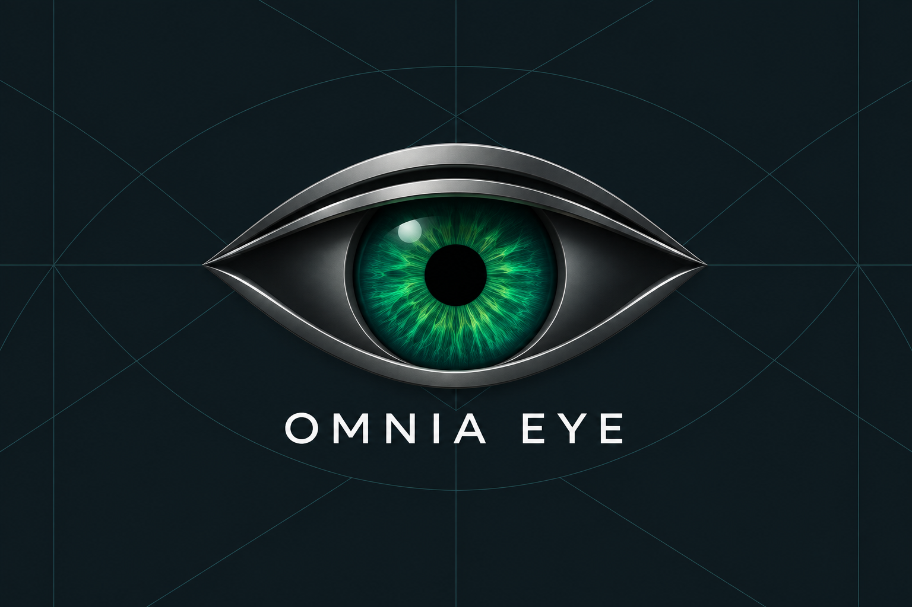
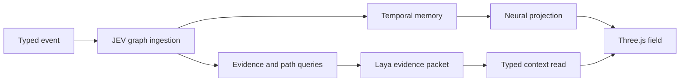

<a id="readme-top"></a>

<p align="center">
  
</p>

<h1 align="center">JEV Neural Data Stream</h1>

<p align="center">
  <strong>Multichain intelligence infrastructure for the OMNIA EYE field.</strong><br />
  A traceable path from network observation to visual context.
</p>

<p align="center">
  <a href="#architecture">Architecture</a> ·
  <a href="#jev-neural-graph">JEV Neural Graph</a> ·
  <a href="#intelligence-field">Intelligence field</a> ·
  <a href="#research-foundations">Research</a> ·
  <a href="#engineering">Engineering</a> ·
  <a href="#documentation">Documentation</a>
</p>

---

## The field

JEV Neural Data Stream is the intelligence surface behind OMNIA EYE’s multichain observatory. It converts normalized network observations and linked social context into a living Three.js field where movement, proximity, scale, and traceability carry meaning.

The system is designed around a simple principle: an observation should remain attributable as it moves from capture to context. Token identity, market fields, source links, capture time, and evidence references retain distinct roles throughout the route.

```text
NETWORK SIGNALS
      │
      ▼
CAPTURE ADAPTERS ──► NORMALIZATION ──► EVIDENCE ENVELOPE
                                                │
                                                ▼
SOCIAL CONTEXT ◄── LINK RESOLUTION ◄── JEV NEURAL ROUTING
                                                │
                                                ▼
                                  OMNIA EYE INTELLIGENCE FIELD
```

## Architecture

JEV is organized as a set of explicit boundaries rather than a visual layer that guesses at data.

| Layer | Responsibility |
| --- | --- |
| **Network lanes** | Preserve the chain identity of Robinhood Chain, BSC, and Solana observations. |
| **Normalization** | Convert incoming records into a stable token and field shape. |
| **Evidence envelope** | Keep capture identity, capture hash, timestamps, and source paths attached to the observation. |
| **Neural routing** | Classify fields into interpretable zones and route changes through the field. |
| **Social trace** | Resolve captured links into token-level context while retaining the originating reference. |
| **Intelligence field** | Present an interactive spatial view where organism scale follows market-cap bands and tracked social context is visible. |

The browser is intentionally a presentation boundary. Collection, authorization, rate control, and source-specific normalization belong to the connector boundary outside the field.

<p align="right">(<a href="#readme-top">back to top</a>)</p>

## JEV Neural Graph

The JEV Neural Graph is the relationship system beneath the field. It treats every captured item as a time-bound event and constructs an inspectable graph from typed nodes, typed edges, and immutable evidence references.

```text
                         ┌──────────────┐
                         │   NARRATIVE  │
                         └──────┬───────┘
                                │ belongs_to
┌──────────┐ captured  ┌────────▼────────┐  mentions  ┌────────────────┐
│  TOKEN   ├──────────►│   OBSERVATION   ├───────────►│ SOCIAL PROFILE │
└────┬─────┘           └────────┬────────┘            └───────┬────────┘
     │                           │ links                         │ shares
     │                           ▼                               ▼
     │                    ┌────────────┐                  ┌──────────┐
     └───────────────────►│   SOURCE   │◄─────────────────│  POST    │
                          └────────────┘                  └──────────┘
```

### Core properties

| Property | JEV behavior |
| --- | --- |
| **Temporal** | every event is ordered by its capture and occurrence time; activations decay rather than disappear arbitrarily. |
| **Heterogeneous** | tokens, fields, sources, profiles, and narratives carry distinct node semantics. |
| **Evidence-bound** | nodes and edges retain capture IDs, payload hashes, source paths, and source URLs where supplied. |
| **Inspectable** | graph paths, communities, strongest links, and evidence trails are directly queryable. |
| **Neural projection** | graph activity resolves into regions, weighted synapses, and deterministic 3D anchors for the JEV field. |
| **Laya-ready** | context packets are bounded, typed, and include only evidence present in the selected subgraph. |

### Neural processing path



## Research foundations

JEV is engineered around established work in temporal graphs, dynamic graph representation, graph explainability, and the provenance constraints of language-model-assisted knowledge systems.

| Research direction | JEV implementation decision |
| --- | --- |
| **Temporal graph memory** | Node activation is updated from event order and decays with time, following the event-and-memory framing of Temporal Graph Networks. |
| **Time-varying topology** | Connections are explicit events with timestamps and can be examined as changing network structure. |
| **Dynamic embeddings** | Projection separates graph identity from its spatial arrangement, allowing the field to change without changing the source graph. |
| **Explainable graph reasoning** | Every visible route can resolve back to node IDs, edge IDs, capture IDs, and source paths. |
| **LLM + knowledge graph discipline** | Laya reads consume bounded graph packets and must cite evidence IDs available in that packet. |

Selected research:

- Rossi et al., [Temporal Graph Networks for Deep Learning on Dynamic Graphs](https://arxiv.org/abs/2006.10637), 2020.
- Casteigts et al., [Time-Varying Graphs and Dynamic Networks](https://arxiv.org/abs/1012.0009), 2010.
- Barros et al., [A Survey on Embedding Dynamic Graphs](https://arxiv.org/abs/2101.01229), 2021.
- Pan et al., [Large Language Models and Knowledge Graphs: Opportunities and Challenges](https://arxiv.org/abs/2308.06374), 2023.
- Baldassarre and Azizpour, [Explainability Techniques for Graph Convolutional Networks](https://arxiv.org/abs/1905.13686), 2019.
- Li and Fan, [Explainable Heterogeneous Anomaly Detection in Financial Networks via Adaptive Expert Routing](https://arxiv.org/abs/2510.17088), 2025.

The research references inform the system design. They do not represent performance claims, training results, or an endorsement by their authors.

<p align="right">(<a href="#readme-top">back to top</a>)</p>

## Intelligence field

The interface treats the field as an instrument panel, not a decorative chart.

- **Neural organism** — a routing sculpture that groups fields such as market, holders, lifecycle, risk, and social context.
- **Multichain lanes** — chain-colored streams carry observations from their network boundary into JEV.
- **Token universe** — organisms are positioned in temporal order, scaled across distinct market-cap bands, and retain their token identity.
- **Social trace** — tracked social references resolve into compact source context, profile identity, follower count where supplied, and original links.
- **Continuous motion** — particles flow continuously through the field; state transitions appear as deliberate, time-spread pulses.
- **Decision vocabulary** — JEV labels operations such as `BUY`, `SKIP`, `HOLD`, `HOLD MOONBAG`, `PROFIT`, `TP1`–`TP5`, and `SL` as interface language. These labels are not trading instructions.

## Engineering

The repository is deliberately compact and readable:

```text
src/
├── agent-trading/       # JEV field, routing, evidence, trace, and motion
├── jev-neural/          # temporal graph, provenance, projection, and Laya contracts
├── components/          # reusable media and platform primitives
├── main.tsx             # application composition
└── media.mjs            # media normalization

public/
├── brand/               # OMNIA visual identity
└── assets/              # platform marks used by trace context

scripts/                 # deterministic behavioral checks
```

The client uses React, TypeScript, Vite, and Three.js. The service boundary is native Node.js and exposes a health endpoint plus bounded internal passthroughs for the normalized capture and recent social-link envelopes.

### JEV Neural Graph modules

```text
jev-neural/
├── domain.ts          typed node, edge, evidence, event, and read vocabulary
├── event-factory.ts   normalized token → graph event construction
├── graph.ts           ingestion, adjacency, paths, and temporal snapshots
├── temporal-memory.ts activation propagation and decay
├── relations.ts       relation construction and shared-attribute links
├── query.ts           communities, strongest edges, and evidence trails
├── projection.ts      graph → neural 3D anchors
├── topology.ts        neural regions and weighted synapses
├── laya-contract.ts   bounded context packet and typed read validation
└── evaluation.ts      read agreement and evidence coverage metrics
```

### Core routing model

```ts
// A routed observation retains the evidence that introduced it.
type NeuralObservation = {
  tokenKey: string;
  captureId: string;
  receivedAt: string;
  field: {
    key: string;
    zone: 'Market' | 'Holders' | 'Risk' | 'Lifecycle' | 'Social';
    path: string;
  };
};
```

### Local development

```bash
npm install
npm run dev
```

```bash
npm run test
npm run typecheck
npm run build
```

## Documentation

- [Architecture](docs/ARCHITECTURE.md) — system boundaries, data movement, and design decisions.
- [JEV Neural Graph](docs/JEV-NEURAL-GRAPH.md) — temporal graph, provenance, activation, and Laya context contract.
- [Data contract](docs/DATA-CONTRACT.md) — normalized envelopes and provenance invariants.
- [Security](docs/SECURITY.md) — trust boundaries and reporting path.
- [Engineering references](docs/REFERENCES.md) — standards and technical sources that inform the system.

## OMNIA EYE

JEV Neural Data Stream is proprietary software maintained by OMNIA EYE. The repository contains the presentation and routing layer; credentials, private connector configuration, raw capture storage, and source-specific access controls are maintained outside version control.

<p align="right">(<a href="#readme-top">back to top</a>)</p>
