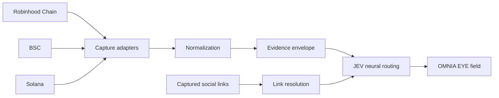

# JEV Neural Data Stream — Architecture

## System context

JEV Neural Data Stream is a visual intelligence application. Its responsibility starts after a connector has emitted a normalized observation and ends at the visual field. It does not own source authentication or raw-source collection.

## Architectural boundaries

### Connector boundary

Connectors own credentials, provider-specific request shapes, pacing, retries, and source normalization. Only the normalized envelope crosses into the JEV application boundary.

### Evidence boundary

Every routed field is anchored to its capture identifier and capture hash. The routing layer refuses to treat a field as evidence when those anchors disagree.

### Presentation boundary

The field visualizes what was routed. It does not perform direct collection from third-party providers. This keeps browser behavior deterministic and prevents client-side credentials from becoming part of the surface area.

## Routing zones

| Zone | Typical observations | Presentation role |
| --- | --- | --- |
| Market | market cap, liquidity, volume | organism scale and market context |
| Holders | holder count, distribution, trader activity | relationship density |
| Risk | permissions, taxes, risk flags | attention and inspection context |
| Lifecycle | launch, age, profile history | temporal organization |
| Social | source links, profile context, narratives | trace visibility |

## Design decisions

1. **Evidence moves with the field.** The same capture anchors are preserved from ingestion through routing.
2. **Chain identity remains first-class.** No chain is merged into a generic lane before the field receives it.
3. **Presentation has no provider privilege.** Browsers consume bounded, normalized endpoints only.
4. **Social context is a trace, not a replacement for source data.** Links remain associated with the capture that surfaced them.

## Runtime shape

The runtime has three moving parts:

1. React composes the data stream, neural field, token universe, hover card, and social trace.
2. Three.js maintains the particle, routing, and organism scene.
3. The Node service serves the compiled surface and proxies bounded normalized envelopes from private connector boundaries.
