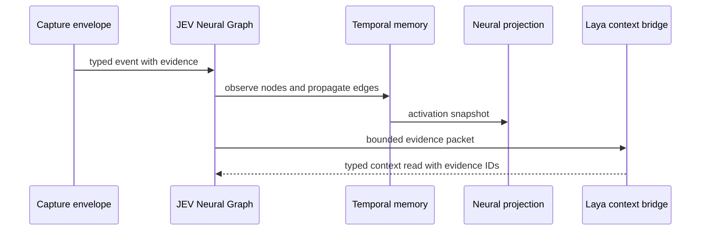

# JEV Neural Graph

JEV Neural Graph is the relationship and temporal-memory foundation of OMNIA EYE's intelligence field.

## Domain

The graph models tokens, observations, sources, social profiles, and narratives as typed nodes. Captured, mention, link, share, and membership relationships are typed edges. Every node and edge carries capture provenance.

## Event path

## Modules

| Module | Responsibility |
| --- | --- |
| `domain.ts` | stable vocabulary for nodes, edges, evidence, events, and reads |
| `evidence.ts` | provenance invariants and endpoint validation |
| `graph.ts` | event ingestion, adjacency, paths, and snapshots |
| `temporal-memory.ts` | activation and time decay per node |
| `projection.ts` | deterministic graph-to-neural-field positions |
| `laya-contract.ts` | bounded evidence packet and typed context read validation |

## Invariants

1. A relationship has known endpoints.
2. A relationship has a capture identity and payload hash.
3. A neural read can cite only evidence provided in its packet.
4. A visual activation derives from graph activity, not arbitrary UI state.
5. Chain identity is preserved at the node boundary.
